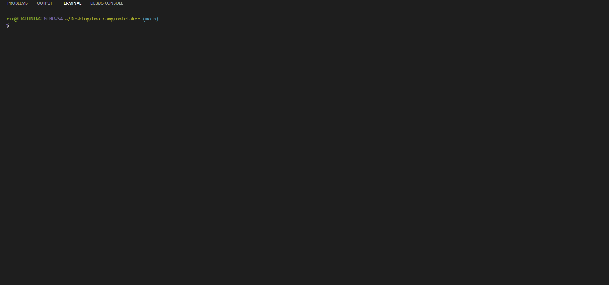

# noteTaker (Assignment #11)

 

For my 11th weekly challenge assignment submission.

This is a simple Express.js application that communicates with a .json file in order to store notes and display them on a page.

### Usage

To use this application you can view the live Heroku deployment or run `npm start` from the root directory (default: localhost:8080).

### Questions? 

GitHub: [@rjcostanzo](https://api.github.com/users/rjcostanzo)